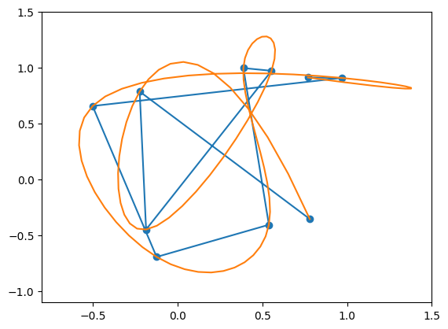
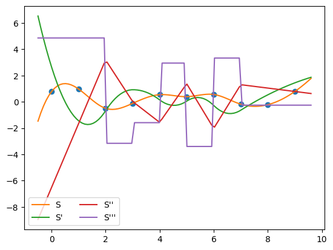
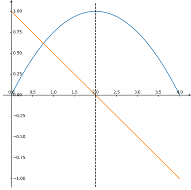

# 基于多项式的轨迹平滑及优化

## 1. 光滑与连续

> 推荐视频 [Youtube | Freya Holmér, The Continuity of Splines](https://youtu.be/jvPPXbo87ds)
> 
轨迹优化，即使一条不光滑的曲线变得光滑。那什么是光滑？如下图所示，把一条折线变成曲线的过程就是光滑的过程。

<center>


</center>

更准确的来说，光滑的轨迹意味着这条轨迹是高阶连续的。例如下图就是一个在位置上连续的曲线 (实际上是 Besier 曲线)，与分段（不连续）的曲线对比。对于位置上连续的曲线我们称该曲线满足 $C^0$。

<center>


</center>

单这样还不够，我们希望机器人在跟随轨迹运动的时候，速度 ($C^1$)，加速度 ($C^2$)，加加速度 ($C^3$)，甚至加加加速度 ($C^4$) 也都是连续的，这样才能满足我们想要的，一条光滑的轨迹。

<center>


</center>

## 2. Cubic Spline

学过《机器人导论》之类课程，如（[台大的机器人学](https://www.bilibili.com/video/BV1v4411H7ez?p=33&vd_source=c21b1fbe5a532229ace96b0090f25485)）的同学们应该还记得，该课程介绍了一种轨迹平滑的方法，叫做 Cubic Spline，即利用三次多项式来拟合轨迹中的关键点，借用多项式连续可导的性质来实现轨迹的光滑。由于多维空间的轨迹可以简化为每一个维度基于时间的变化。因此，以 x 轴为例，两点之间的轨迹方程为：

$$
x(t) = at^3 + bt^2 + ct + d
$$

对于上面这种有 4 个参数的方程来说，想要求解参数，一定要跟参数数量一致的条件，即 4 个条件，才可以。假如我们想要利用这个方程来生成点 A 到 点 B 再到点 C 的轨迹，那么我们先要对轨迹分段为 $A \rightarrow B$ 和 $B \rightarrow C$的两段，并对每段轨迹 fit 一个 3 次曲线。

$$
\begin{align*}
    &x_1(t) = a_1t^3 + b_1t^2 +c_1t + d_1 \qquad 0\leq t < T_1\\
    &x_2(t) = a_2t^3 + b_2t^2 + c_2t + d_2 \qquad T1\leq t < T_2\\
\end{align*}
$$

对他们求导就可以得到:

$$
\begin{align*}
    &\dot{x_1}(t) = 3a_1t^2 + 2b_1t +c_1 \qquad 0\leq t < T_1\\
    &\dot{x_2}(t) = 3a_2t^2 + 2b_2t + c_2 \qquad T1\leq t < T_2\\
\end{align*}
$$

再求导：

$$
\begin{align*}
    &\ddot{x_1}(t) = 6a_1t + 2b_1 \qquad 0\leq t < T_1\\
    &\ddot{x_2}(t) = 6a_2t + 2b_2 \qquad T1\leq t < T_2\\
\end{align*}
$$


对于每一段曲线，想要求解 $a,\ b,\ c,\ d$ 我们都需要找到 4 个约束条件，总共就是 8 个约束条件。而这 8 个约束条件来自边界条件和连续性条件：

**边界条件：**

边界条件即起始时刻和终止时刻的状态条件。开始与终止时刻，轨迹分别在 $P_a$ 和 $P_c$，且处于静止状态 ($V_a = V_c = 0$) 。这种边界条件被成为 `nature bounary condition`。

$$
\begin{alignat}{3}
    &x_1(0) &&= d_1 &&= P_a\\
    &\dot{x_1}(0) &&= c_1 &&= 0\\
\end{alignat}
$$

$$
\begin{alignat}{3}
        &x_2(T_2) &&= a_2T_2^3 + b_2T_2^2 + c_2T_2 +d_2 &&= P_c\\
        &\dot{x_2}(T_2) &&= 3a_2T_2^2 + 2b_2T_2 + c_2 &&= 0 
\end{alignat}
$$

**连续性条件**

连续性条件是指在两条曲线的连接点 $P_b$ 处，曲线依然是连续的。即: $x_1(T_1) = x_2(T_1) = p_b$, $\dot{x_1}(T_1) = \dot{x_2}(T_1)$, $\ddot{x_1}(T_1) = \ddot{x_2}(T_1)$

$$
\begin{alignat}{3}
        &x_1(T_1) &&= a_1T_1^3 + b_1T_1^2 + c_1T_1 +d_1 &&= P_b\\
        &x_2(T_1) &&= a_2T_1^3 + b_2T_1^2 + c_2T_1 +d_1 &&= P_b\\
\end{alignat}
$$
 
$$
\begin{align}
        \dot{x_1}(T_1) = 3a_1T_1^2 + 2b_1 =
        6a_2T_2 + 2b_2 = \dot{x_2}(T_1)
\end{align}
$$

$$
\begin{align}{}
        \ddot{x_1}(T_1) = 6a_1T_1 + 2b_1T_1 + c_1 =
        3a_2T_2^2 + 2b_2T_1 + c_2 = \ddot{x_2}(T_1)
\end{align}
$$

下面我们使用 `scipy` 里的 `CubicSpline` 来对随机的 10 个 $x, y \in (-1, 1)$ 的点进行 Cubic Spline:

```py
from scipy.interpolate import CubicSpline
import matplotlib.pyplot as plt
import numpy as np

t = np.arange(10)
# Randomly generate 10 Points between -1 to 1.
points = np.random.uniform(-1, 1, size=(10, 2))
cs = CubicSpline(t, points)

xs = np.linspace(-0.5, 9.6, 100)

fig, ax = plt.subplots()
ax.set_xlim(-1.1, 1.1)
ax.set_ylim(-1.1, 1.1)
plt.plot(points[:,0], points[:,1], "o")
plt.plot(cs(xs)[:,0], cs(xs)[:,1])
plt.show()
```

<center>



</center>

这个曲线看起来还是挺光滑的，接下来我们来看看它的导数们如何。下面我画了 x 轴对时间的曲线：

```py
plt.plot(t, points[:,0], 'o')
plt.plot(xs, cs(xs)[:,0], label="S")
plt.plot(xs, cs(xs, 1)[:,0], label="S'")
plt.plot(xs, cs(xs, 2)[:,0], label="S''")
plt.plot(xs, cs(xs, 3)[:,0], label="S'''")
plt.legend(loc='lower left', ncol=2)
plt.show()
```

<center>



</center>

从上图来看，轨迹的位置，速度，加速度，都是连续的，但加加速度(S''') 并不连续，因此 Cubic Spline 是满足 $C^2$ 的。 

## 3. Cubic Spline 的问题


## 4. 轨迹优化

> Ref:
> - [Lecture | Motion Planning](https://www.shenlanxueyuan.com/course/575) 
> - [Paper | Minimum Snap Trajectory Generation and Control for Quadrotors](https://web.archive.org/web/20120713162030id_/http://www.seas.upenn.edu/~dmel/mellingerICRA11.pdf)

而 Minimum Snap 简单来说就是使用 5 次多项式拟合原有轨迹中的关键点，

$$
x(t) = p_5 t^5 + p_4 t^4 + p_3 t^3 + p_2 t^2 + p_1 t + p_0
$$

其中 $p_i$ 为方程的因数，也是我们想要求解的。

那为什么叫 Minimum Snap 呢？首先我们要知道 Snap 是什么。上面的轨迹方程就是点的位置随时间变化的表达式，那么对轨迹求导就可以得到速度随时间变化的表达式，当我们求到第四次导的时候，就得到了 Snap 随时间变化的表达式了。

$$
\begin{alignat*}{6}
    &Position: &x(t) &= p_5t^5 &&+ p_4 t^4 &&+ p_3 t^3 &&+ p_2 t^2 &&+ p_1 t + p_0\\
    &Velocity: &x^{(1)}(t) &= 5p_5t^4 &&+ 4p_4t^3 &&+ 3 p_3 t^2 &&+ 2p_2 t &&+ p_1\\
    &Acceleration: &x^{(2)}(t) &= 20p_5t^3 &&+ 12p_4t^2 &&+ 6p_3t &&+ 2p_2\\
    &Jolt: &x^{(3)}(t) &= 60p_5t^2 &&+ 24p_4t &&+ 6p_3\\
    &Snap &x^{(4)}(t) &= 120p_5t &&+ 24p_4\\
\end{alignat*}
$$

那么，我们为什么要最小化 Snap 呢？因为对于一个二次型函数，其导数的零点，就其极值点。而我们所说的最小化 Snap，实际上是最小化 $Snap^2$。通过这样的性质


<center>



</center>

$$
\begin{alignat*}{9}
    & &&y(x) &&= ax^2 + bx + c\\\\
    &\because &&y(0) &&= start,\ y(T) = end\\
    &\therefore && c &&= start\\
    &\therefore && end &&= aT^2 + bT + start\\
    &\therefore && a &&= (end - start - bT)/T^2\\\\
    & &&\dot{y}(x) &&= 2ax + b \\
    &Min\ &&y(x)^2 &&= 4a^2x^2 +4abx + b^2\\\\
    &\therefore &&a &&= 
\end{alignat*}
$$


