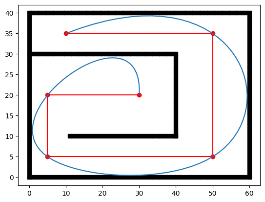

# 轨迹平滑及优化 - 由浅入深

## 1. 光滑与连续

> 推荐视频 [Youtube | Freya Holmér, The Continuity of Splines](https://youtu.be/jvPPXbo87ds)
> 
轨迹优化，即使一条不光滑的曲线变得光滑。那什么是光滑？如下图所示，把一条折线变成曲线的过程就是光滑的过程。

<center>


</center>

更准确的来说，光滑的轨迹意味着这条轨迹是高阶连续的。例如下图就是一个在位置上连续的曲线 (实际上是 Besier 曲线)，与分段（不连续）的曲线对比。对于位置上连续的曲线我们称该曲线满足 $C^0$。

<center>


</center>

单这样还不够，我们希望机器人在跟随轨迹运动的时候，速度 ($C^1$)，加速度 ($C^2$)，加加速度 ($C^3$)，甚至加加加速度 ($C^4$) 也都是连续的，这样才能满足我们想要的，一条光滑的轨迹。

<center>


</center>

## 2. Cubic Spline

学过《机器人导论》之类课程，如（[台大的机器人学](https://www.bilibili.com/video/BV1v4411H7ez?p=33&vd_source=c21b1fbe5a532229ace96b0090f25485)）的同学们应该还记得，该课程介绍了一种轨迹平滑的方法，叫做 Cubic Spline，即利用三次多项式来拟合轨迹中的关键点，借用多项式连续可导的性质来实现轨迹的光滑。由于多维空间的轨迹可以简化为每一个维度基于时间的变化。因此，以 x 轴为例，两点之间的轨迹方程为：

$$
x(t) = at^3 + bt^2 + ct + d
$$

对于上面这种有 4 个参数的方程来说，想要求解参数，一定要跟参数数量一致的条件，即 4 个条件，才可以。假如我们想要利用这个方程来生成点 A 到 点 B 再到点 C 的轨迹，那么我们先要对轨迹分段为 $A \rightarrow B$ 和 $B \rightarrow C$的两段，并对每段轨迹 fit 一个 3 次曲线。

$$
\begin{align*}
    &x_1(t) = a_1t^3 + b_1t^2 +c_1t + d_1 \qquad 0\leq t < T_1\\
    &x_2(t) = a_2t^3 + b_2t^2 + c_2t + d_2 \qquad T1\leq t < T_2\\
\end{align*}
$$

对他们求导就可以得到:

$$
\begin{align*}
    &\dot{x_1}(t) = 3a_1t^2 + 2b_1t +c_1 \qquad 0\leq t < T_1\\
    &\dot{x_2}(t) = 3a_2t^2 + 2b_2t + c_2 \qquad T1\leq t < T_2\\
\end{align*}
$$

再求导：

$$
\begin{align*}
    &\ddot{x_1}(t) = 6a_1t + 2b_1 \qquad 0\leq t < T_1\\
    &\ddot{x_2}(t) = 6a_2t + 2b_2 \qquad T1\leq t < T_2\\
\end{align*}
$$


对于每一段曲线，想要求解 $a,\ b,\ c,\ d$ 我们都需要找到 4 个约束条件，总共就是 8 个约束条件。而这 8 个约束条件来自边界条件和连续性条件：

**边界条件：**

边界条件即起始时刻和终止时刻的状态条件。开始与终止时刻，轨迹分别在 $P_a$ 和 $P_c$，且处于静止状态 ($V_a = V_c = 0$) 。这种边界条件被成为 `nature bounary condition`。

$$
\begin{alignat}{3}
    &x_1(0) &&= d_1 &&= P_a\\
    &\dot{x_1}(0) &&= c_1 &&= 0\\
\end{alignat}
$$

$$
\begin{alignat}{3}
        &x_2(T_2) &&= a_2T_2^3 + b_2T_2^2 + c_2T_2 +d_2 &&= P_c\\
        &\dot{x_2}(T_2) &&= 3a_2T_2^2 + 2b_2T_2 + c_2 &&= 0 
\end{alignat}
$$

**连续性条件**

连续性条件是指在两条曲线的连接点 $P_b$ 处，曲线依然是连续的。即: $x_1(T_1) = x_2(T_1) = p_b$, $\dot{x_1}(T_1) = \dot{x_2}(T_1)$, $\ddot{x_1}(T_1) = \ddot{x_2}(T_1)$

$$
\begin{alignat}{3}
        &x_1(T_1) &&= a_1T_1^3 + b_1T_1^2 + c_1T_1 +d_1 &&= P_b\\
        &x_2(T_1) &&= a_2T_1^3 + b_2T_1^2 + c_2T_1 +d_1 &&= P_b\\
\end{alignat}
$$
 
$$
\begin{align}
        \dot{x_1}(T_1) = 3a_1T_1^2 + 2b_1 =
        6a_2T_2 + 2b_2 = \dot{x_2}(T_1)
\end{align}
$$

$$
\begin{align}{}
        \ddot{x_1}(T_1) = 6a_1T_1 + 2b_1T_1 + c_1 =
        3a_2T_2^2 + 2b_2T_1 + c_2 = \ddot{x_2}(T_1)
\end{align}
$$

下面我们使用 `scipy` 里的 `CubicSpline` 来点 (10, 35), (50,35), (50, 5), (5, 5),(5,20), (30,20) 进行 Cubic Spline:

```py
from scipy.interpolate import CubicSpline
import matplotlib.pyplot as plt
import numpy as np

points = np.array([[10, 35], [50,35], [50, 5], [5, 5], [5,20], [30,20]])
n = points.shape[0]
t = np.arange(n)
cs = CubicSpline(t, points)
xs = np.linspace(0, n-1, 100)
plt.plot(points[:,0], points[:,1], "ro-")
plt.plot(cs(xs)[:,0], cs(xs)[:,1])
plt.show()
```

<center>


</center>

这个曲线看起来还是挺光滑的，接下来我们来看看它的导数们如何。下面我画了 x 轴对时间的曲线：

```py
plt.plot(t, points[:,0], 'o')
plt.plot(xs, cs(xs)[:,0], label="S")
plt.plot(xs, cs(xs, 1)[:,0], label="S'")
plt.plot(xs, cs(xs, 2)[:,0], label="S''")
plt.plot(xs, cs(xs, 3)[:,0], label="S'''")
plt.legend(loc='upper right', ncol=2)
plt.show()
```

<center>


</center>

从上图来看，轨迹的位置，速度，加速度，都是连续的，但加加速度(S''') 并不连续，因此 Cubic Spline 是满足 $C^2$ 的。 

## 3. Cubic Spline 的问题

> 本节只提出问题，解决方案会在下一节提出。

### 3.1 缺少环境约束

由于轨迹规划通常都是在有障碍的环境内进行的，而 Cubic Spline 在生成轨迹的时候并不会考虑障碍物。例如上面的例子，假如原本的路径是在如下的地图中生成的，那么 Cubic Spline 以及均匀的时间分配下，生成的轨迹就会穿过障碍物，这样纵使轨迹再平滑也没有办法使用。

<center>


</center>

造成这个现象的主要原因是 Cubic Spline 在平滑两点之间的轨迹时会出现类似“超调”的现象。而这个超调的大小则是根据该段路径被分配的时间得到的，例如时间越长，则“超调”就越大。

```py
points = np.array([[10, 35], [50,35], [50, 5], [5, 5]])
plt.plot(points[:,0], points[:,1], "ro")

t = np.arange(4)
for i in range(1,5):
    t[2] = t[1] + i
    t[3] = t[2] + 1
    cs = CubicSpline(t, points)
    xs = np.linspace(0, t[-1], 100)
    plt.plot(cs(xs)[:,0], cs(xs)[:,1],label="dt2="+str(i))

plt.legend(loc='upper right', ncol=2)
plt.show()
```

<center>


</center>

同样是上面的地图，当时间调节合适的时候，比如：经过每个点的时间分别是 [0, 1.7, 4.3, 6.8, 8.6,11.8] 的时候,就可以生成合理的轨迹。

```py
t2 = np.array([0, 1.7, 4.3, 6.8, 8.6, 11.8])
cs2 = CubicSpline(t2, points)
xs = np.linspace(0, t2[-1], 100)

plt.plot(ox, oy, "sk")
plt.plot(points[:,0], points[:,1], "ro-")
plt.plot(cs2(xs)[:,0], cs2(xs)[:,1])
```

<center>



</center>

虽然时间分配可以解决“超调”的问题，但如何合理的分配时间呢？

### 3.3 关键点的选择

上面例子中的关键点虽然可以保证折线轨迹基本处于路的中间位置，但根据这些关键点来平滑轨迹的空间就缩小了很多。但如果可以使得关键点更靠近内部的障碍物，那么留给轨迹平滑的空间也有越大了。例如，将之前的关键点改后轨迹平滑的效果如下：

<center>


</center>

但如何合理的选择关键点呢？

### 3.4 机器人的运动学约束

很多机器人都是具有运动学约束的，例如，机器人的最大加速度，最大速度，最大转角速度等等。这些约束在轨迹平滑的时候也是必须考虑的，不然轨迹也是没有办法跟随的。例如下面画圈的位置，如果机器人的最小转弯半径太大，就无法非常好的跟随这条轨迹。

<center>


</center>

### 3.5 不够平滑

通过之前对 Cubic Spline 的求导可以看出来，虽然 Cubic Spline 已经达到 $C^2$ 标准了，但在现实世界里，加加速度，甚至是加加加速度也应该是连续的，因此我们可以权衡一下计算量和平滑程度，适当的增加多项式的次数来使得轨迹更加平滑。

但对于更多次数的多项式，求解的难度也会增加，我们该如何求解呢？

## 4. 轨迹优化

### 4.1 Minimum Snap

为了解决上面的问题，我们引入 "Minimum Snap Trajectory Generation" 方法。

> Ref:
> - [Lecture | Gao Fei, Motion Planning](https://www.shenlanxueyuan.com/course/575) 
> - [Paper | Minimum Snap Trajectory Generation and Control for Quadrotors](https://web.archive.org/web/20120713162030id_/http://www.seas.upenn.edu/~dmel/mellingerICRA11.pdf)


首先解决最简单的问题，轨迹不够平滑，那就增加次数，3 次不够用 5 次， 5 次不够用 7 次。（为了简化表达式，接下来只展示 5 次多项式）

$$
x(t) = p_5 t^5 + p_4 t^4 + p_3 t^3 + p_2 t^2 + p_1 t + p_0
$$

> 其中 $p_i$ 为方程的因数，也是我们想要求解的。

接下来就是求解了，这里我们使用的方法叫 "Minimum Snap"。为什么叫 "Minimum Snap" 呢？首先我们要知道 Snap 是什么。上面的轨迹方程就是点的位置随时间变化的表达式，那么对轨迹求导就可以得到速度随时间变化的表达式，当我们求到第四次导的时候，就得到了 Snap 随时间变化的表达式了。

$$
\begin{alignat*}{6}
    &Position: &x(t) &= p_5t^5 &&+ p_4 t^4 &&+ p_3 t^3 &&+ p_2 t^2 &&+ p_1 t + p_0\\
    &Velocity: &x^{(1)}(t) &= 5p_5t^4 &&+ 4p_4t^3 &&+ 3 p_3 t^2 &&+ 2p_2 t &&+ p_1\\
    &Acceleration: &x^{(2)}(t) &= 20p_5t^3 &&+ 12p_4t^2 &&+ 6p_3t &&+ 2p_2\\
    &Jolt: &x^{(3)}(t) &= 60p_5t^2 &&+ 24p_4t &&+ 6p_3\\
    &Snap &x^{(4)}(t) &= 120p_5t &&+ 24p_4\\
\end{alignat*}
$$

> 代数拓展：
> 
> 将上面的多项式转换成矩阵形式：
>
>$$
\begin{bmatrix}
    x(t)\\ x^{(1)}(t) \\ x^{(2)}(t) \\ x^{(3)}(t) \\ x^{(4)}(t)
\end{bmatrix} = 
\begin{bmatrix}
    t^5 & t^4 & t^3 & t^2 & t & 1 \\
    5t^4 & 4t^3 & 3t^2 & 2t & 1 & 0 \\
    20t^3 & 12t^2 & 6t & 2 & 0 & 0 \\
    60t^2 & 24t & 6 & 0 & 0 & 0 \\
    120t & 24 & 0 & 0 & 0 & 0
\end{bmatrix}
\begin{bmatrix}
    p_5 \\ p_4 \\ p_3\\ p_2 \\ p_1 \\ p_0
\end{bmatrix}
>$$
>
>再代数归纳一下，对于一个 $n$ 次多项式，其第 $k$ 次导数的表达式就是：
>
>$$
f^{(k)}(t) = \sum_{i=0}^{n} A_i^k t^{i-k}p_i
>$$
>
>$$
A_i^k = 
\begin{cases}
    i!/(i-k)! = i(i-1)(i-2)...(i-k) & i \geq k \\
    0 & i < k
\end{cases}
>$$


那么，我们为什么要最小化 Snap 呢？一共有两个原因：

- 原因一 (ChatGPT 告诉我的)：最小化 Snap 可以节省能量，当整个轨迹所需要的 Snap 最小的时候，也就意味着整个轨迹所消耗的能量最小。当然这个要看能量在轨迹规划中的权重如何，如果时间对我们来说更加重要，那么我们就应该最小化时间。

<center>


</center>

- 原因二，Minimum Snap 可以将轨迹优化问题转变成一个 Quadratic Programming (QP) 问题，这样就可以使用现有的凸优化求解器来解决了。比如：

  - [CVX](http://cvxr.com/cvx/#:~:text=CVX%20is%20a%20Matlab-based%20modeling%20system%20for%20convex,For%20example%2C%20consider%20the%20following%20convex%20optimization%20model%3A)： 最出名的凸优化求解器，原版是基于 Matlab 的。
  - [CVXPY](https://www.cvxpy.org/) 和 [CVXOPT](https://cvxopt.org/)：虽然用不了原版的 CVX，但一些人仿造并开源了 Python 版本。
  - [SCIPY](https://docs.scipy.org/doc/scipy/tutorial/optimize.html)：如果你已经有 Scipy 并且不想再安装其他的软件包，那么你可以使用 Scipy 自带的凸优化求解器 scipy.optimize。
  - [OOQP](https://pages.cs.wisc.edu/~swright/ooqp/)：是 C++ 中常用的开源凸优化求解器，但代码只提供了 C 的接口，所以语法比较古老。
  - [OSQP](https://osqp.org/)：是一个轻量化，专门用来求解 QP 问题的求解器，且它开发了 C, Python, Julia, Matlab, R 语言的接口。
  - [OSQP-Eigen](https://robotology.github.io/osqp-eigen/)：习惯使用 Eigen 矩阵的人可以使用这个接口。

> 拓展内容：
> - 快速了解什么是凸优化 [UC berkeley web page| Convex Optimization](https://inst.eecs.berkeley.edu/~ee127/sp21/livebook/l_cp_main.html)


接下来就要仔细讲一讲，如何最小化 snap，即将轨迹优化问题转变成一个 QP 问题。首先，我们要知道，QP 问题的形式是这样的：

$$
\begin{alignat*}{3}
    &\min_{x}\quad &&\frac{1}{2}x^TPx + q^Tx + r \tag{1}\\
    &\text{s.t.} &&Gx \leq h \tag{2}\\
    & &&Ax = b \tag{3}
\end{alignat*}
$$

其中： 公式 (1) 就是我们要最小化的目标函数，必须是一个凸函数。公式 (2) 和 (3) 是该函数的约束条件，他们都是线性的。

用不太准确但通俗易懂的方式来描述就是在一定范围内找到目标函数的最小值：

<center>


</center>

### 4.2 目标函数

最小化 snap，严谨来说是最小化 snap 的总和，同时要确保其是一个二次型函数，所以我们的目标函数在 $T_{j-1}$ 到 ${T_j}$ 段上为：

$$
J(T) = \int_{T_{j-1}}^{T_j} (f^{(4)}(t))^2 dt
$$

将其转换为 QP 的形式：

首先，我们将 $(f^{(4)}(t))^2$ 展开：

$$
\begin{alignat*}{3}
    &\ &&f^{(4)}(t) &&= \sum_{i \geq 4}^{n} i(i-1)(i-2)(i-3)t^{i-4}p_i\\
    & \Rightarrow &&(f^{(4)}(t))^2 &&= \sum_{i \geq 4, l \geq 4}^{n} i(i-1)(i-2)(i-3)l(l-1)(l-2)(l-3)t^{i+l-8}p_ip_l\\
\end{alignat*}
$$

然后对其积分：

$$
\begin{align*}
    J(T) &= \int_{T_{j-1}}^{T_j} (f^{(4)}(t))^2 dt \\
    &= \sum_{i \geq 4, l \geq 4}^{n} \frac{i(i-1)(i-2)(i-3)l(l-1)(l-2)(l-3)}{i+l-7}T_j^{i+l-7}T_{j-1}^{i+l-7}p_ip_l\\
    &=\begin{bmatrix}
        \vdots \\ p_i \\ \vdots
    \end{bmatrix}^T
    \begin{bmatrix}
        \vdots & \vdots\\ 
        \dots \frac{i(i-1)(i-2)(i-3)j(j-1)(j-2)(j-3)}{i + j - 7}(T_j^{i+j-7} - T_{j-1}^{i+j-7}) &
        \frac{i(i-1)(i-2)(i-3)(j+1)j(j-1)(j-2)}{i + j - 6}(T_j^{i+j+1-7} - T_{j-1}^{i+j+1-7})\dots 
        \\ \vdots & \vdots
    \end{bmatrix}^T
    \begin{bmatrix}
        \vdots \\ p_i \\ \vdots
    \end{bmatrix}\\
    &= P^TQP
\end{align*}
$$

此处的 Python 代码为：

```py
import numpy as np
def ComputeQ(n,r,ts,te):
    '''
    args:
        n is the number of parameters
        r is the derivative order
        ts is the start time of this segment
        te is the end time of this segment
    return:
        one segment Q matrix of QP.
    '''
    Q = np.zeros((n,n))
    for i in range(n):
        for j in range(n):
            if i >= r and j >= r:
                factor = i+j-2*r+1
                Q[n-1-i][n-1-j] = factorial(i,r)*factorial(j,r)/factor*(te**factor-ts**factor)
    return Q

def factorial(n,r):
    '''
    return A_n^(n-r)
    '''
    if (n < r):
        return 0
    ans = 1
    for _ in range(r):
        ans = ans*n
        n -= 1
        
    return ans
```

对于整段轨迹（假设我们有 M 段），则我们的目标函数为：

$$
\begin{align*}
    J &= J_1 + J_2 + \dots + J_M\\
      &= \sum_{m=1}^{M} P_m^TQ_mP_m \\
      &= \begin{bmatrix}
        P_0 \\ P_1 \\ \vdots \\ P_M
      \end{bmatrix}^T
      \begin{bmatrix}
        Q_0 & 0 & \dots & 0 \\
        0 & Q_1 & \dots & 0 \\
        \vdots & \vdots & \ddots & \vdots \\
        0 & 0 & \dots & Q_M
      \end{bmatrix}
      \begin{bmatrix}
        P_0 \\ P_1 \\ \vdots \\ P_M
      \end{bmatrix}
\end{align*}
$$

### 4.3 约束

在 QP 中，存在两种约束，一种是等式约束：$Ax = b$，另外一种是不等式约束： $Gx \leq h$。之前在解决 Cubic Spline 的时候已经提到过，对于轨迹规划问题，我们需要考虑的约束有路径点约束和连续性约束。这两种约束都是等式约束，因此可以作为 $Ax = b$ 的形式加入到 QP 中。

#### 4.3.1 路径点约束

对于起点和终点来说，车辆的状态必须是静止的，所以有:

$$f_0^{(k)}(0) = f_M^{(k)}(T_M) = 0,\ k \in (0,r)$$

> 例如 minimum snap 则 r = 4。共有 $2(r-1)$ 个等式

当 $k=0$ 时，每段路径必须在路径点上：

$$
\begin{alignat*}{5}
    &f_j(T_j) &&=\begin{bmatrix}
        T^n_j & T_j^{n-1} & \dots & T_j^0
    \end{bmatrix}
    \begin{bmatrix}
        p_{j,n} \\ p_{j,n-1} \\ \vdots \\ p_{j,0} 
    \end{bmatrix} = {Pos}_j
\end{alignat*}
$$

> 共有 $M-1$ 个等式，$M$ 是轨迹的段数

统一格式后可以得到 $A_jP_j = d_j$，其中 $A_j$ 是与 $T$ 相关的一维横向量，$d_j$ 是与 $Pos_j$ 相关的一维纵向量。

#### 4.3.2 连续性约束

对任意一段轨迹 $f_j(t)$，其第 $k$ 阶导数 $f_j^{(k)}(t),\ k \in [0, r)$ 在起止点处分别与其前后段的轨迹连续，假设某段的终止点时间为 $T_j$，则有:

$$
\begin{alignat*}{5}
    & &&f_j^{(k)}(T_j) = f_{j+1}^{(k)}(T_j)\\
    &\Rightarrow &&\sum_{i\geq k} \frac{i!}{(i-k)!}T^{i-k}_jp_{j,i} - \sum_{l\geq k} \frac{l!}{(l-k)!}T^{l-k}_{j}p_{j+1,l} = 0\\
    &\Rightarrow && \begin{bmatrix}
        \dots \frac{i!}{(i-k)!}T^{i-k}_j \dots  -\frac{l!}{(l-k)!}T^{l-k}_{j} \dots
    \end{bmatrix}
    \begin{bmatrix}
        \vdots \\ p_j \\ \vdots \\ p_{j+1} \\ \vdots 
    \end{bmatrix}= 0\\
    &\Rightarrow && \begin{bmatrix}
        A_j &-A_{j+1}
    \end{bmatrix}
    \begin{bmatrix}
        p_j \\ p_{j+1}
    \end{bmatrix}=0
\end{alignat*}
$$

> 共有 $(M-1)*(r-1)$ 个等式

#### 4.3.3 小结

上面的两个约束条件都是等式约束，因此可以拼接为一个大的矩阵等式 $Ax = b$。其中 $x$ 就是 $P$，而 $P$ 向量的大小是 $1\times M(n+1)$，$M$ 是轨迹的段数，$n$是多项式的阶数，$n+1$ 是多项式的参数数量。$b$ 向量的大小为 $1\times(M+1)r-2$，所以 $A$ 的大小为$(M+1)r-2 \times MN$。此部分的 Python 代码：

```py

```


并且解决了 Cubic Spline 中连续性不够的问题。

### 5. 安全走廊

为了让生成出来的轨迹满足安全性条件，

> Ref:
> [Paper | Zhepei Wang, Geometrically Constrained Trajectory Optimization
for Multicopters](https://arxiv.org/pdf/2103.00190.pdf)

### 6. 